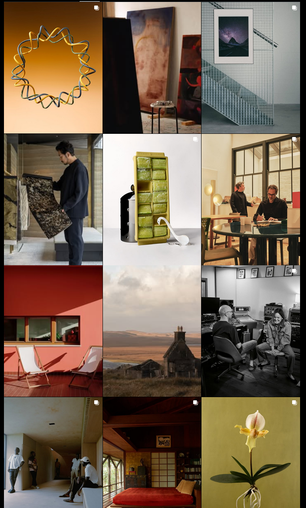
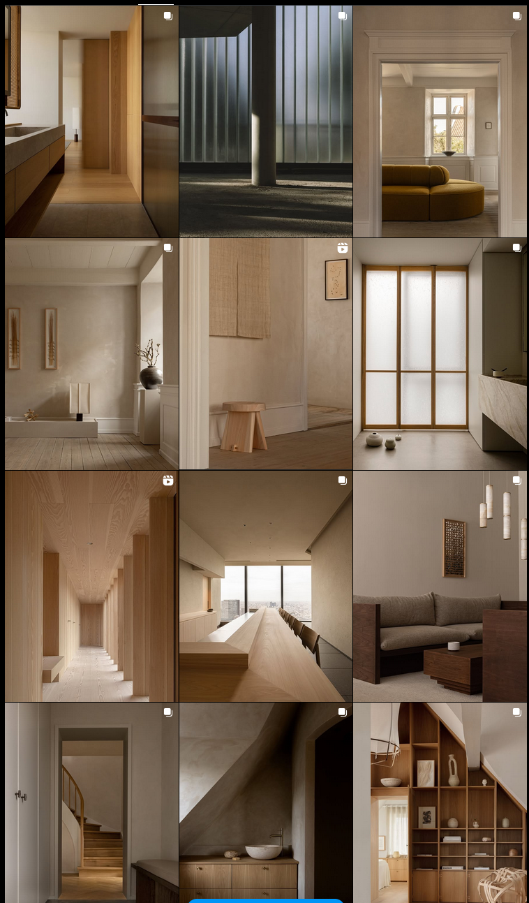
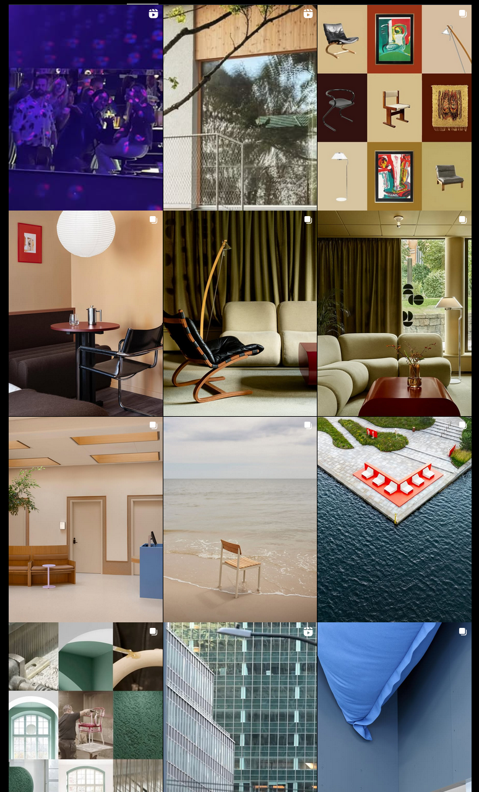

# Nordic Minimalism (Scandinavian Design) — Study Notes

## Museums & Collections

### [Designmuseum Danmark (Copenhagen)](https://designmuseum.dk/en/samlinger/genstandssamlinger/)
**Overview:** Denmark’s central design museum houses an extensive collection spanning furniture, ceramics, textiles, and industrial design. It offers a comprehensive look into the evolution of Danish Modernism and its minimalist ethos.  
**Design Notes:** Observe the restrained use of materials, craftsmanship, and functional design principles — especially works by Arne Jacobsen and Kaare Klint. The exhibits emphasize harmony between utility and beauty, key tenets of Nordic minimalism.  

### [ArkDes — Swedish Centre for Architecture & Design (Stockholm)](https://arkdes.se/en/)
**Overview:** ArkDes is Sweden’s national architecture and design museum, renowned for its vast archive of drawings, models, and photographs.  
**Design Notes:** Look for examples of minimal, human-centered urban design and architectural clarity. Exhibitions often balance structure and warmth — clean geometries paired with natural materials like wood and stone.  

### [Architecture & Design Museum Helsinki (Finland)](https://admuseo.fi/en/)
**Overview:** A merger of Finland’s Design Museum and Museum of Finnish Architecture, this institution showcases Finnish contributions to functional design.  
**Design Notes:** Study works by Alvar Aalto and contemporaries. Finnish minimalism often integrates nature — through organic forms, birch textures, and light — resulting in designs that are serene yet purposeful.  

### [National Museum of Norway (Oslo)](https://www.nasjonalmuseet.no/en/)
**Overview:** Norway’s largest art, design, and architecture collection. The museum’s new building itself reflects minimalist Nordic architecture.  
**Design Notes:** Observe the subtle interplay between form, light, and material. Many exhibitions reveal how Norwegian minimalism uses simplicity to emphasize atmosphere and emotional resonance.  

### [IKEA Museum (Älmhult, Sweden)](https://ikeamuseum.com/en/explore/the-story-of-ikea/)
**Overview:** Chronicles IKEA’s philosophy of “Democratic Design,” balancing form, function, quality, and sustainability.  
**Design Notes:** Focus on affordability and accessibility without sacrificing minimal aesthetics. IKEA’s clean, modular design language reflects Scandinavian ideals of simplicity and everyday beauty.  

---

## Publications & Books

### [Scandinavian Design – Charlotte & Peter Fiell (Taschen)](https://www.amazon.com/Scandinavian-Design-40th-Charlotte-Fiell/dp/3836598426)
**Overview:** A comprehensive survey of 20th-century Scandinavian design across furniture, ceramics, and industrial products.  
**Design Notes:** Use this as a reference for historical context. Notice recurring minimalist values — craftsmanship, clean lines, and function-first approaches across decades.  

### [The Red Thread: Nordic Design (Phaidon)](https://www.phaidon.com/en-us/products/the-red-thread-nordic-design)
**Overview:** A narrative tracing the evolution of Nordic design through key objects and designers.  
**Design Notes:** The “red thread” metaphor ties heritage and innovation. Observe how designers blend modern utility with timeless restraint.  

### [New Nordic Design – Dorothea Gundtoft (Thames & Hudson)](https://www.thamesandhudson.com/products/new-nordic-design)
**Overview:** A contemporary showcase of designers, interiors, and products defining modern Nordic aesthetics.  
**Design Notes:** Focus on tactile materials, neutral palettes, and calm atmospheres. Highlights how minimalism remains emotionally rich and human-centered.  

### [Northern Comfort: The Nordic Art of Creative Living (Gestalten)](https://us.gestalten.com/products/northern-comfort)
**Overview:** A lifestyle-focused exploration of Nordic interiors and the art of living simply.  
**Design Notes:** Study the “hygge” dimension — warmth, texture, and quiet elegance. The visual storytelling demonstrates how minimalism adapts to domestic and everyday contexts.  

### [Ark Journal (Copenhagen)](https://www.ark-journal.com/about/)
**Overview:** A biannual Danish magazine blending architecture, art, and design in serene layouts.  
**Design Notes:** Notice the use of white space, soft color palettes, and natural light in both content and layout. Ark Journal embodies Scandinavian calm and editorial minimalism.  

---

## Websites (Study These)

### [Norm Architects](https://normcph.com/)
**Overview:** Danish studio known for architecture and product design merging softness with precision.  
**Design Notes:** Examine spatial balance, subdued tones, and tactile materials. Projects often express the concept of “soft minimalism,” emphasizing human comfort within minimal spaces.  

### [FRAMA CPH](https://us.framacph.com/)
**Overview:** A multidisciplinary design house bridging furniture, lighting, and spatial concepts.  
**Design Notes:** Focus on the material honesty and warm brutalist aesthetic. The FRAMA aesthetic demonstrates minimalism grounded in texture and craftsmanship.  

### [Muuto](https://www.muuto.com/)
**Overview:** A modern Danish brand offering furniture and lighting that reinterpret Scandinavian traditions.  
**Design Notes:** Observe how Muuto balances modern industrial methods with simplicity and warmth. The brand’s name — “Muutos,” meaning “new perspective” — reflects evolution within minimalism.  

---

## Instagram Accounts

### [@kinfolk](https://www.instagram.com/kinfolk/)
**Overview:** Kinfolk is an influential publication and creative studio shaping the “slow living” and minimalist aesthetic worldwide.  
**Design Notes:** Study its visual storytelling — clean compositions, natural light, and muted tones. The account exemplifies the harmony of design, culture, and lifestyle that defines Nordic minimalism.  

### [@normarchitects](https://www.instagram.com/normarchitects/)
**Overview:** Showcases serene interiors, architecture, and product design with a consistent material palette.  
**Design Notes:** Focus on how they translate spatial calm into photographic form — balanced geometry, soft shadows, and tactile detail. A visual masterclass in “soft minimalism.”  

### [@notedesignstudio](https://www.instagram.com/notedesignstudio/)
**Overview:** A Stockholm-based studio blending furniture, product, and interior design with playful restraint.  
**Design Notes:** Notice how they merge color, form, and functionality while maintaining the Nordic balance of minimalism and warmth. Great case study of conceptual clarity meeting material experimentation.  

